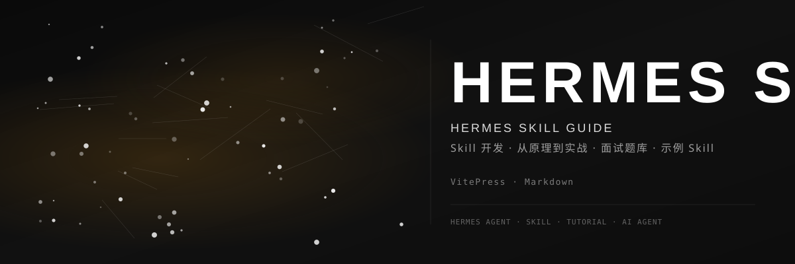

<div align="center">



<br>

### 📘 Hermes Skill 开发指南

[](https://github.com/dirjaker/hermes-skill-guide/stargazers)
[](https://github.com/dirjaker/hermes-skill-guide/network/members)
[](https://github.com/dirjaker/hermes-skill-guide/graphs/contributors)
[](https://github.com/dirjaker/hermes-skill-guide/blob/dev/LICENSE)

</div>

---

## 📖 项目简介

Hermes Agent 的 Skill 系统深度解析：从原理到实战，从开发到面试。本项目是一份全面的 Hermes Agent Skill 开发指南，帮助开发者理解、创建和优化 Skill，提升 AI Agent 的工作效率。

**适合人群：**

- 想深入了解 Hermes Agent 架构的开发者
- 准备 AI Agent 相关面试的候选人
- 想要高效使用 Hermes 的用户

## ✨ 功能特性

| 功能 | 描述 |
|------|------|
| 📖 **8 个核心章节** | 从 Skill 基础概念到高级面试题，系统覆盖全部知识点 |
| 🧪 **5 个示例 Skill** | 基础、高级、Docker 部署、API 文档生成等实战示例 |
| 📝 **40 道面试题** | 基础题 20 道 + 进阶题 20 道，覆盖 Skill 开发高频考点 |
| 🔧 **开发模板** | 标准化的 Skill 项目模板，快速开始开发 |
| 🚀 **实战案例** | 5 个真实项目案例，展示 Skill 在实际工作中的应用 |
| 💡 **最佳实践** | Skill 设计模式、性能优化、团队协作技巧 |

## 📖 在线文档

<div align="center">

**📚 [点击访问在线文档](https://dirjaker.github.io/hermes-skill-guide/)**

</div>

## 🗂️ 内容概览

### 核心章节

| 章节 | 标题 | 主要内容 |
|------|------|----------|
| 第一章 | [什么是 Skill](docs/chapters/01-what-is-skill.md) | 核心定义、与其他概念对比、价值分析 |
| 第二章 | [Skill 的结构详解](docs/chapters/02-skill-structure.md) | 文件结构、YAML 头部、Markdown 正文规范 |
| 第三章 | [Skill 开发实战指南](docs/chapters/03-development-guide.md) | 开发流程、实战案例、开发技巧 |
| 第四章 | [常见问题和解决方案](docs/chapters/04-common-pitfalls.md) | 开发/匹配/执行阶段的 10 个常见问题 |
| 第五章 | [Hermes 如何调用 Skill](docs/chapters/05-how-hermes-calls-skill.md) | 调用流程、匹配算法、调试技巧 |
| 第六章 | [面试常见问题](docs/chapters/06-interview-questions.md) | 基础概念、设计思想、实现细节题（Q1-Q20） |
| 第七章 | [最佳实践总结](docs/chapters/07-best-practices.md) | 开发/使用/设计最佳实践、面试准备要点 |
| 第八章 | [进阶面试题](docs/chapters/08-advanced-interview-questions.md) | 设计模式、实现细节、场景应用题（Q21-Q40） |

### 示例 Skill

| 示例 | 说明 |
|------|------|
| [基础 Skill](docs/examples/basic-skill.md) | Git Commit 规范 — 简洁实用的入门示例 |
| [高级 Skill](docs/examples/advanced-skill.md) | FastAPI 后端开发 — 包含 references 和 templates |
| [Docker 部署 Skill](docs/examples/docker-deploy-skill.md) | Docker 容器化部署完整流程 |
| [API 文档生成 Skill](docs/examples/api-doc-generator-skill.md) | 自动生成 OpenAPI/Swagger 文档 |
| [实际项目案例](docs/examples/real-project-cases.md) | 5 个真实项目中的 Skill 应用案例 |

### 开发模板

| 文件 | 说明 |
|------|------|
| [Skill 模板](docs/templates/skill-template.md) | 标准化模板 + 填写指南 + 完整示例 |

## 🔑 核心概念

```
Skill = 可复用的程序记忆

     = YAML 元数据     （定义：我是谁、我做什么、何时触发）
     + Markdown 正文   （描述：怎么做、验证清单）
     + 触发条件        （规则：什么时候用我）
     + 执行步骤        （指导：具体怎么做）
```

### Skill vs Memory vs Plugin

| 特性 | Skill | Memory | Plugin |
|------|-------|--------|--------|
| **本质** | 程序记忆 | 事实记忆 | 外部工具 |
| **内容** | 如何做某事 | 某个事实 | 功能扩展 |
| **格式** | 结构化文档 | 短文本 | 代码 |
| **触发** | 任务匹配 | 上下文相关 | 显式调用 |

## 🚀 快速开始

```bash
# 克隆项目
git clone https://github.com/dirjaker/hermes-skill-guide.git
cd hermes-skill-guide

# 创建虚拟环境
conda create -n hermes-skill-guide python=3.12 -y
conda activate hermes-skill-guide

# 安装依赖
pip install -r requirements.txt

# 本地运行文档站点
npm install
npm run dev
```

## 🛠️ 技术栈

| 层级 | 技术 |
|------|------|
| **文档引擎** | VitePress |
| **内容** | Markdown |
| **部署** | GitHub Pages |
| **搜索** | VitePress 内置 |

## 📊 内容统计

| 类别 | 数量 | 说明 |
|------|------|------|
| 核心章节 | 8 章 | 从基础到高级 |
| 面试题 | 40 道 | 基础 20 + 进阶 20 |
| 示例 Skill | 5 个 | 覆盖常见场景 |
| 实战案例 | 5 个 | 真实项目经验 |
| 模板文件 | 1 个 | 可直接使用 |

## 📝 开发日志

- [x] 8 个核心章节
- [x] 5 个示例 Skill
- [x] 40 道面试题（基础 + 进阶）
- [x] 5 个实战案例
- [x] GitHub Pages 部署
- [x] VitePress 搜索
- [x] 开发模板
- [ ] 视频教程
- [ ] 在线实验环境
- [ ] 社区讨论

## 📄 许可证

[MIT License](LICENSE)

---

<div align="center">

🔗 **GitHub**: [dirjaker/hermes-skill-guide](https://github.com/dirjaker/hermes-skill-guide)

⭐ 如果这个项目对你有帮助，请给一个 Star 支持一下！

</div>
